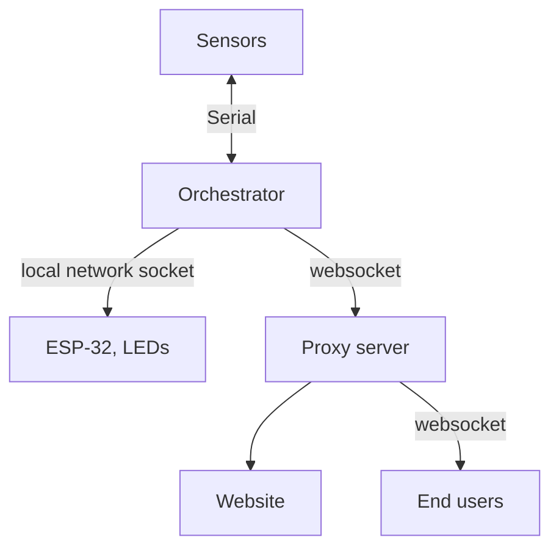

A fun and useful project for a hackerspace is to be able to share whether the
space is openned or closed to the public at any given time.

At [hackens](https://www.hackens.org), it's an idea that fermented for a while
and I somehow ended up writing most of the communication code. It's 100% a
plumbing project, so I'll at least try to make it worthwile.

While looking online to learn about how to use `asyncio`, I mostly found
examples so minimal I struggled to see how they would fit in a real project.
Wading through the documentation, with a bit of trial and error, I learned a
lot about asynchronous programming, from a client and server perspective, and I
hope to give some insight into how some elements of the `asyncio` module in
Python can be used in real-world examples.

I will assume you have some notion of asynchronous computation, including what
is a coroutine and how it differs from regular callables, and what is an event
loop. If needed there's a quick refresher [at the end](#async-refresher).

## Project overview

First, let me describe the overall architecture of the system. It's not too
complicated, but there are just quite a few elements here. If you want to look
into it further, all the code for the project is publicly available on [a git
forge](https://git.dgnum.eu/HackENS/PCF/src/branch/add_websocket/).


The data flows downstream, from the sensors, to a central orchestrator, to local
network clients and to the exterior through a proxy server.



The sensors do not do any computation, instead they send the raw data to the
orchestrator through a serial connection, which parses it, interprets it, and
returns a status (open/closed, forced/not forced) to the sensor box to
indicate the status through a LED.

The orchestrator also publishes the status to all the registred clients. Currently,
this includes an ESP-32 at the entrance of the space which turns on a LED strip
when the space is open, and a proxy server. Since the ESP-32 is on the same local
network, we chose to connect through a socket, and the connexion to the proxy
server is done through a (authenticated) websocket.

Since there are only a few clients, the IO there is done synchronously. But,
because we want to react to a change in the state without stalling the system and
by sharing the change as soon as possible, I opted for an async protocol for
the serial connection.

Now, the proxy server exposes one public websocket, which can have many clients
connected to it. This socket is purely one-directional: clients can't make requests
to the server, they have to listen. Because of this, we opted for an async server
design here.

## async websockets: the easy part

The relevant part of the project is available
[here](https://git.dgnum.eu/HackENS/PCF/src/branch/add_websocket/clients/hackens_org/websocket.py).

We'll start with the proxy server. It's as simple as possible, one websocket
listens to the orchestrator to get the current status, and another publishes
the state.

Python's websocket module,
[`websockets`](https://github.com/python-websockets/websockets) has a very good
async workflow, taking a coroutine (that deals with one connection) and
creating another one (that deals with all connections throughout the life of
the server). It is then a matter of defining the desired behavior and
scheduling the execution of the server. In its most simple form, it is built
like this:

```python
from websockets.asyncio.server import serve
server = await serve(
  server_fn,
  hostname,
  port,
  **kwargs
)

# Now, schedule `server.serve_forever()` for execution
```

where `server_fn` is a coroutine with the signature `server_fn(connection) -> None`.

Here is the important bit: nothing will not run right now. We simply defined
an object containing all the info needed. In order to actually run the server,
we need to:
1. get a coroutine that handles the connections (e.g. `server.serve_forever()`)
2. schedule that coroutine

By defining several coroutines and scheduling them as tasks (typically using
the `asyncio.TaskGroup` mechanism), we can have multiple servers running
concurrently.

Simply put, we have code that looks like this:
```python
import asyncio
from websockets.asyncio.server import serve

async def main():
  listener = await serve(
    listen_fn,
    hostname_l,
    port_l,
    **kwargs_l
  )
  speaker = await serve(
    speak_fn,
    hostname_s,
    port_s,
    **kwargs_s
  )

  async with asyncio.TaskGroup() as tg:
      tg.create_task(listener.serve_forever())
      tg.create_task(speaker.serve_forever())

asyncio.run(main())
```

## `asyncio.Protocol`-based subscribe/publish server

The relevant part of the project is available
[here](https://git.dgnum.eu/HackENS/PCF/src/branch/add_websocket/milieu/pcf_server.py).

The orchestrator has the main challenge of dealing with serial connections, for
which we don't have as nice an interface as for websockets. The module we use
is [`serial_asyncio`](https://github.com/pyserial/pyserial-asyncio). If you
don't already know what you're doing, the documentation can be quite
lackluster, basically telling you to write your own
[protocol](https://docs.python.org/3/library/asyncio-protocol.html) (factory).

While it's presented mainly as a way to handle TCP/UDP/whatever network
protocol you want, at its core, an `asyncio.Protocol` is a way to do callbacks
on a connection. The actual detail of _how_ the data is sent is not the job of
the protocol, but of its associated `asyncio.Transport` object, which will not
be covered here. The only thing you need to know about the `Transport` objects
is that they have a reference to the underlying event loop and handle all the
scheduling of I/O tasks, including of the callbacks defined in the `Protocol`.

> Since all the `loop.call_{soon,later,...}` methods take a callable (instead of
> the coroutines we're used to now), the callbacks defined in `Protocol` are
> indeed functions, despite still being part of an asynchronous I/O pipeline.
{: .prompt-info }

By writing your own protocol, you can customize the behavior when:
- the connection is created (`connection_made`)
- data is received (`data_received`, `eof_received`)
- there is an interruption (`pause_writing`, `resume_writing`)
- the connection is lost (`connection_lost`)

For us, the purpose of the protocol we implement is to:
- parse the incoming data
- trigger a broadcast when a state change is noticed

Basically, we want to override the `data_received` method and follow the
recipe given by `serial_asyncio`. So, that's what we do:

```python
import asyncio
import serial_asyncio

###############################################################################
# Defining the protocol

class MyProtocol(asyncio.Protocol):
  """Splits data per line and processes each line individually."""
  def __init__(self):
    self.buffer = ""

  def data_recieved(self, data: bytes):
    self.buffer += str(data, encoding="utf-8")
    if "\n" in self.chunk:
      messages = self.chunk.split("\n")
      self.chunk = messages[-1]
      self.process(messages[:-1])

  def process(self, messages: list[str]):
    # Do stuff here


###############################################################################
# Instanciating and running the protocol

# Replace with asyncio.get_event_loop if needed
event_loop = asyncio.new_event_loop()

async def reader():
  transport, protocol = await serial_asyncio.create_serial_connection(
    event_loop,
    MyProtocol,
    serial_port,
    baudrate=115200,
  )
event_loop.run_until_complete(reader())
event_loop.close()
```

Now, we have the structure of the reader server. But how do we trigger
side-effects? Well, `serial_asyncio.create_serial_connection` takes a protocol
_factory_. So, we can just hide any and all arguments inside a lambda, with
something that looks like:

```python
class MyProtocol(asyncio.Protocol):
  def __init__(self, arg):
    self.thing = arg

  def process(self, messages):
    self.thing.do_whatever(messages)

  ...

  transport, protocol = await serial_asyncio.create_serial_connection(
    event_loop,
    lambda: MyProtocol(arg),
    serial_port,
    baudrate=115200,
  )
```

In practice, we have a `State` class that stores the current state and signals
the clients to broadcast whenever a change occurs. The specifics of `broadcaster`
depends on which clients are registered and don't really matter here.
If you're curious, the concrete implementation is
[here](https://git.dgnum.eu/HackENS/PCF/src/branch/add_websocket/milieu/connections.py)

So, in the end, we have:

```python
import asyncio
import serial_asyncio

###############################################################################
# Defining the state keeper

class State:
    def __init__(self, broadcaster: Broadcaster):
        self._current_status = OutsideStatus.CLOSED
        self.broadcaster = broadcaster

    @property
    def current_status(self) -> OutsideStatus:
        return self._current_status

    @current_status.setter
    def current_status(self, val) -> None:
        if self._current_status != val:
            self._current_status = val
            self.broadcaster.broadcast(self._current_status)


###############################################################################
# Defining the protocol

class MyProtocol(asyncio.Protocol):
  """Splits data per line and processes each line individually."""
  def __init__(self, state: State):
    self.buffer = ""
    self.state = state

  def data_recieved(self, data: bytes):
    self.buffer += str(data, encoding="utf-8")
    if "\n" in self.chunk:
      messages = self.chunk.split("\n")
      self.chunk = messages[-1]
      self.process(messages[:-1])

  def process(self, messages: list[str]):
    new_status = self.get_stats_from_messages(messages)
    self.state.current_status = new_status


###############################################################################
# Instanciating and running the protocol

# Replace with asyncio.get_event_loop if needed
event_loop = asyncio.new_event_loop()
state = State(broadcaster = ...)

async def reader():
  transport, protocol = await serial_asyncio.create_serial_connection(
    event_loop,
    lambda: MyProtocol(state),
    serial_port,
    baudrate=115200,
  )
event_loop.run_until_complete(reader())
event_loop.close()
```

Now, I mentionned that, because in our case we know the subscribed clients, that
there are only a handful of them, we do not need to have the broadcast itself
be asynchronous.

If we wanted to go a step further and actually have the broadcast itself be
asynchronous, I think a way to do it would be to:
- have `self.broadcaster.broadcast` be a coroutine (details depend on the
  underlying connection), 
- pass the `event_loop` object to the state
- replace `self.broadcaster.broadcast(...)` by
  `event_loop.create_task(self.broadcaster.broadcast(...)`

## Conclusion

This was a very technical article, more than I usually like to write, but I
figured some simple but actually useful examples of using `asyncio` in
different contexts are always useful to have around.

Writing the code for this project, I had to rethink the architecture quite a
few times to accomodate for the async pipeline, which is not something I
usually care for. Hopefully, with these examples in mind, you can get some idea
of how to structure a project around these IO tasks, whether by having a
server-based or a protocol-based architecture.

## Async refresher

Traditionally, we think of programs as a list of instructions being ran from top
to bottom, one after another, in a well specified order. This has the benefit
of being easier to write and more predictible. But it has the drawback of 
potentially waiting on IO bound tasks.

Asynchronous programming, for the most part, is designed around finding a way
not to wait while there is still something else to be done. A typical example
is a web server. If a server has several clients to serve, you could:
1. send a ressource to client 1
2. wait that client 1 acknowledges
3. send a ressource to client 2
4. wait that client 2 acknowledges
5. be happy that both clients are served

Or, you could reorder the operations and:
1. send a ressource to client 1
2. send a ressource to client 2
3. wait that both clients 1 and 2 acknowledge
4. be happier that both clients are served at more or less the same time

In other words, if you have two letters to send, you can either wait for the
delivery notice before sending the next one (synchronous case) or send both
letters at the same time and wait only once for the delivery notices. In
particular, if something went wrong and the first letter took forever to
deliver, we don't have to wait to send the second letter, and both letter
delivery times are uncorrelated.

But how do we do this in practice? Well, we schedule, much like an operating
system schedules which process to run at any given CPU cycle. Essentially,
our program is a big loop that looks like this pseudocode:

```python
while True:
  new_task = select_task_to_run()
  execute_a_bit(new_task)
```

That loop is called an _event loop_. It's the brain of the operations. You, as
the programmer, will interact with this loop by creating _coroutines_ and
scheduling them.

A _coroutine_ is a partially ran function, and is defined like so:
```python

async def send_letter():
  print("Sending letter.")
  await async.time(1)
  print("Letter has been received!")

coro = send_letter()  # <-- this is a coroutine
```

When defined, a coroutine doesn't do _anything_. It's because it has not been
scheduled yet. To schedule a coroutine, you can do it in several ways:
- implicitely inside another `async` block using the keyword `await`
- explicitely by using any high-level function like `asyncio.run` or low-level
  methods of the event loop.

The `await` keyword is a fence, the execution can't go further without having
executed what's behind. You ask the program to _wait_ until the instruction is
finished to continue. But this doesn't mean that unrelated tasks can't run at
the same time, and that's the magic of it!

If we continue our example, `send_letter` prints a first message and waits for
1 second before printing a message. If we only run this once, it's not much
different from having a synchronous code. However, if we run it several times
in quick succession, it's like the letter example, we will send multiple
executions at once and all the prints will arrive more or less at the same
time.

```python

async def main():
  coros = [send_letter() for _ in range(5)]
  tasks = [asyncio.create_task(coro) for coro in coros]
  for t in tasks:
    await t

if __name__ == "__main__":
  asyncio.run(main())
```

If we run this code, the output will be:

```console
Sending letter.
Sending letter.
Sending letter.
Sending letter.
Sending letter.
Letter has been recieved!
Letter has been recieved!
Letter has been recieved!
Letter has been recieved!
Letter has been recieved!
```

What we did here is, first, create a new coroutine (`main`) which:
- get 5 coroutines of the same function
- schedule their execution (using the task mechanism)
- wait for all tasks to finish before returning
And finally, execute `main` (`asyncio.run`).

Under the hood, `asyncio` manages the event loop so you don't have to think
about it and have a nicer interface to work with.

That's all for the refresher on async programming in Python, now go back to [the article](#project-overview)!
